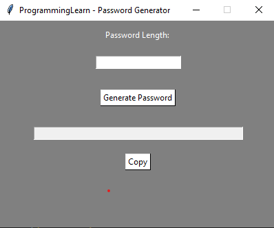

# 🔐 Password Generator  

A **simple and secure password generator** built using **Python** with `tkinter` for the graphical user interface (GUI) and `random` for generating passwords. This tool allows users to create strong passwords with customizable lengths and easily copy them to the clipboard.  

---

## ✨ Features  

- 🔢 **Customizable Length**: Enter the desired length of the password.  
- 🔀 **Random Generation**: Generates a strong password with a mix of letters, numbers, and symbols.  
- 📋 **Copy Button**: Easily copy the generated password to the clipboard.  
- 🎨 **User-Friendly GUI**: Simple and intuitive interface using `tkinter`.  

---

## 🛠️ Installation & Setup  

### Prerequisites  
Ensure you have **Python 3.x** installed on your system.  

### Install Required Modules  
The required modules are built-in, but you can install `pyperclip` (for clipboard functionality) if needed:  

```bash
pip install pyperclip  
```

---

## 🚀 How to Run  

1. **Clone or download** this repository.  
2. **Run the script**:  

```bash
python password_generator.py  
```

3. The GUI will open, allowing you to generate secure passwords.  

---

## 🎮 How to Use  

1. **Enter Password Length**: Input the desired password length in the text field.  
2. **Click "Generate Password"**: A strong password will be displayed.  
3. **Copy Password**: Click the **Copy** button to save the password to your clipboard.  

---

## 🖼️ Screenshot  

  

---

## 🎥 **YouTube Tutorial**

If you prefer a video tutorial on how to use the **ProgrammingLearn Password Generator**, check out this video on my YouTube channel:

[Watch the tutorial](https://www.youtube.com/channel/UCmTJ3BqaTs2QN0-zLt3Me1w)

You can also follow my channel for more programming tutorials and project walkthroughs.

---

## 🧑‍💻 Code Functions  

- `generatePassword()`: Generates a random password with letters, numbers, and symbols.  
- `copyPassword()`: Copies the generated password to the clipboard.  

---

## 📄 License  

This project is open-source and available under the **MIT License**.  
